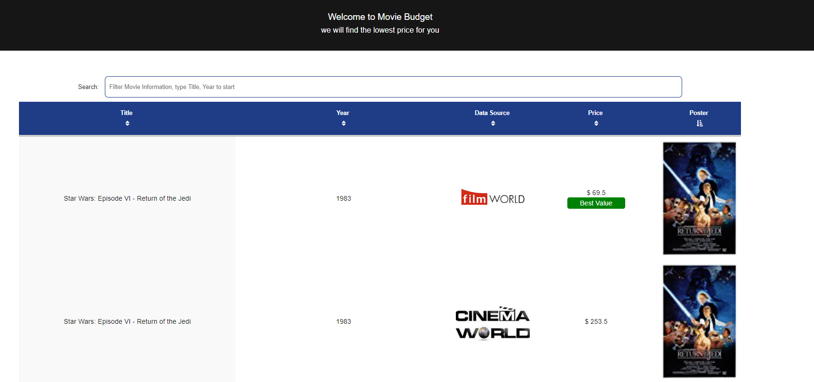

# react-render-movie-list


This code will render movie data from available source, able to filter data by year, movie name, price

  1.display loading icon while calling API

  2.render UI from the response list

  3.generate image according to data source

  4.render the best value icon based on the details

  5.when response list is empty, display message


demo: http://rachelreact.azurewebsites.net/


``` Chrome is the best compatible browser ```

<p align="center">
  
</p>
